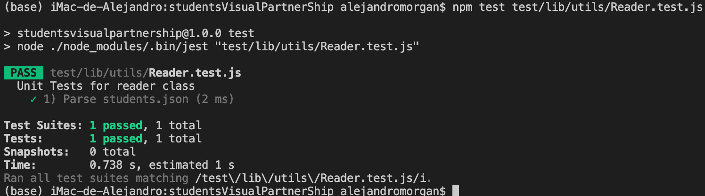
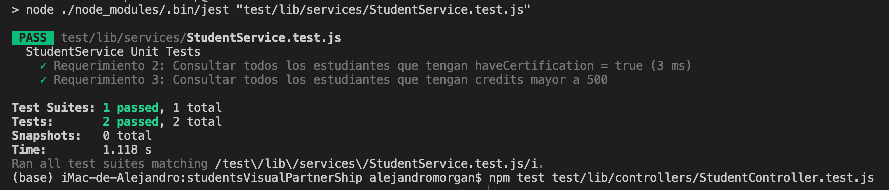

# studentsVisualPartnerShip
Code challenge - Visual Partner-Ship students endpoints Express

New Proyectiva node js and express

1. Iniciar nuevo proyecto con node `npm init` (crea package.json)
2. Instalar package de pruebas `npm install --save-dev jest`
3. Instalar express `npm install express —save`
4. Instalar linter `npm install eslint --save-dev`
5. Crear carpetas `.github/workflows`
6. crear archivo `.github/workflows/test.yml`

#### Test.yml
```markdown
	name: Run Tests in my project every push on GitHub

on: [push]

jobs:
  build:
    runs-on: ubuntu-latest
    steps:
    - uses: actions/checkout@v1
    - name: Run Jest
      uses: stefanoeb/jest-action@1.0.3
```

7. Crear carpetas `lib/utils`
8. Crear archivo `/lib/utils/Reader.js`
9. Crear carpetas `test/lib/utils`
10. crear archivo `test/lib/utils/Reader.test.js`
11. Configurar archivo package.json

#### package.json

```javascript
{
  "name": "studentsvisualpartnership",
  "version": "1.0.0",
  "description": "Code challenge - Visual Partner-Ship students endpoints Express",
  "main": "index.js",
  "scripts": {
    "test": "node ./node_modules/.bin/jest",
    "linter": "node ./node_modules/eslint/bin/eslint.js .",
    "linter-fix": "node ./node_modules/eslint/bin/eslint.js . --fix",
    "server": "node ./lib/server.js"
  },
  "repository": {
    "type": "git",
    "url": "git+https://github.com/unciafidelis/FizzBuzz.git"
  },
  "keywords": [],
  "author": "Alejandro Morgan",
  "license": "MIT",
  "bugs": {
    "url": "https://github.com/unciafidelis/FizzBuzz/issues"
  },
  "homepage": "https://github.com/unciafidelis/FizzBuzz#readme",
  "devDependencies": {
    "eslint": "^8.14.0",
    "jest": "^26.0.0"
  },
  "dependencies": {
    "express": "^4.18.1"
  }
}
```
12. Borrar node modules
13. Borrar package-lock.json
14. Correr `npm update` to rebuild the project
15. Crear archivo test `/test/lib/utils/Reader.test.js`

#### Reader.test.js

```javascript
const Reader = require("../../../lib/utils/Reader");

describe("Unit Tests for reader class", () => {
    test('1) Parse students.json', () => {
        const students = new Reader
        expect(students.readJsonPath("./students.json").length).toBe(51)
    })
})
```
(Para obtener el tamaño total de registros contenidos en students.json)
16. Create js file `/lib/utils/Reader.js`

#### Reader.js

```javascript
class Reader{

    readJsonPath(filePath){
        const fs = require("fs");
        const rawdata = fs.readFileSync(filePath);
        const students = JSON.parse(rawdata);
        return students;
    }
    
}
module.exports = Reader;
```
(readJsonPath obtiene el contenido de un archivo json dado el path de ese archivo)

17. Crear archivo students.json

#### students.json

```javascript
[
    {
      "id": "6264d5d89f1df827eb84bb23",
      "name": "Warren",
      "email": "Todd@visualpartnership.xyz",
      "credits": 508,
      "enrollments": [
        "Visual Thinking Intermedio",
        "Visual Thinking Avanzado"
      ],
      "previousCourses": 1,
      "haveCertification": true
    },
    {
      "id": "6264d5d85cf81c496446b67f",
      "name": "Lucinda",
      "email": "Sexton@visualpartnership.xyz",
      "credits": 677,
      "enrollments": [
        "Visual Thinking Avanzado"
      ],
      "previousCourses": 6,
      "haveCertification": true
    },
    {
      "id": "6264d5d8cda17de0d2e9f236",
      "name": "Fuentes",
      "email": "Sharlene@visualpartnership.xyz",
      "credits": 210,
      "enrollments": [
        "Visual Thinking Avanzado"
      ],
      "previousCourses": 10,
      "haveCertification": true
    },
    {
      "id": "6264d5d8878a117a9c57c5c4",
      "name": "Claudia",
      "email": "Howell@visualpartnership.xyz",
      "credits": 227,
      "enrollments": [
        "Visual Thinking Avanzado"
      ],
      "previousCourses": 5,
      "haveCertification": true
    },
    {
      "id": "6264d5d8dd1a0be4e249c662",
      "name": "Phillips",
      "email": "Camacho@visualpartnership.xyz",
      "credits": 973,
      "enrollments": [
        "Visual Thinking Intermedio"
      ],
      "previousCourses": 8,
      "haveCertification": false
    },
    {
      "id": "6264d5d8dd01ab97ddedbba5",
      "name": "Taylor",
      "email": "Haynes@visualpartnership.xyz",
      "credits": 652,
      "enrollments": [
        "Visual Thinking Avanzado"
      ],
      "previousCourses": 5,
      "haveCertification": true
    },
    {
      "id": "6264d5d89d03e25451f124e5",
      "name": "Mindy",
      "email": "Alfreda@visualpartnership.xyz",
      "credits": 830,
      "enrollments": [
        "Visual Thinking Intermedio",
        "Visual Thinking Avanzado"
      ],
      "previousCourses": 9,
      "haveCertification": false
    },
    {
      "id": "6264d5d82c0b4c7dfb0b6ad5",
      "name": "Kara",
      "email": "Simon@visualpartnership.xyz",
      "credits": 833,
      "enrollments": [
        "Visual Thinking Avanzado"
      ],
      "previousCourses": 8,
      "haveCertification": false
    },
    {
      "id": "6264d5d88214a862261ab1a3",
      "name": "Young",
      "email": "Montoya@visualpartnership.xyz",
      "credits": 447,
      "enrollments": [
        "Visual Thinking Avanzado",
        "Visual Thinking Básico"
      ],
      "previousCourses": 9,
      "haveCertification": true
    },
    {
      "id": "6264d5d876e13bc0a8ee0bff",
      "name": "Constance",
      "email": "Benton@visualpartnership.xyz",
      "credits": 311,
      "enrollments": [
        "Visual Thinking Intermedio",
        "Visual Thinking Básico"
      ],
      "previousCourses": 7,
      "haveCertification": true
    },
    {
      "id": "6264d5d8a77fc9d454044d98",
      "name": "Cora",
      "email": "Shari@visualpartnership.xyz",
      "credits": 921,
      "enrollments": [
        "Visual Thinking Avanzado",
        "Visual Thinking Intermedio"
      ],
      "previousCourses": 3,
      "haveCertification": false
    },
    {
      "id": "6264d5d84b49870f8ac742ed",
      "name": "Terra",
      "email": "Jasmine@visualpartnership.xyz",
      "credits": 388,
      "enrollments": [
        "Visual Thinking Avanzado"
      ],
      "previousCourses": 5,
      "haveCertification": false
    },
    {
      "id": "6264d5d87e5aaed2d52b7bf6",
      "name": "Roxanne",
      "email": "Dionne@visualpartnership.xyz",
      "credits": 964,
      "enrollments": [
        "Visual Thinking Básico",
        "Visual Thinking Avanzado"
      ],
      "previousCourses": 10,
      "haveCertification": true
    },
    {
      "id": "6264d5d8ed556685cf55a58e",
      "name": "Whitney",
      "email": "Wells@visualpartnership.xyz",
      "credits": 186,
      "enrollments": [
        "Visual Thinking Básico"
      ],
      "previousCourses": 8,
      "haveCertification": false
    },
    {
      "id": "6264d5d8b89c3c603f0c7db5",
      "name": "Dina",
      "email": "Marissa@visualpartnership.xyz",
      "credits": 341,
      "enrollments": [
        "Visual Thinking Intermedio"
      ],
      "previousCourses": 6,
      "haveCertification": false
    },
    {
      "id": "6264d5d8b1cc4cd567bcf354",
      "name": "Bennett",
      "email": "Martin@visualpartnership.xyz",
      "credits": 707,
      "enrollments": [
        "Visual Thinking Intermedio"
      ],
      "previousCourses": 3,
      "haveCertification": false
    },
    {
      "id": "6264d5d8d88c29406af17d12",
      "name": "Burke",
      "email": "Marie@visualpartnership.xyz",
      "credits": 397,
      "enrollments": [
        "Visual Thinking Avanzado",
        "Visual Thinking Intermedio"
      ],
      "previousCourses": 4,
      "haveCertification": false
    },
    {
      "id": "6264d5d8b7b5eaccfc8f51f1",
      "name": "Bessie",
      "email": "Mcpherson@visualpartnership.xyz",
      "credits": 558,
      "enrollments": [
        "Visual Thinking Intermedio",
        "Visual Thinking Básico"
      ],
      "previousCourses": 4,
      "haveCertification": true
    },
    {
      "id": "6264d5d8b4b46a11ea710c21",
      "name": "Obrien",
      "email": "Gracie@visualpartnership.xyz",
      "credits": 876,
      "enrollments": [
        "Visual Thinking Avanzado",
        "Visual Thinking Intermedio"
      ],
      "previousCourses": 3,
      "haveCertification": true
    },
    {
      "id": "6264d5d8d6646dc0187f08d3",
      "name": "Orr",
      "email": "Nikki@visualpartnership.xyz",
      "credits": 225,
      "enrollments": [
        "Visual Thinking Básico",
        "Visual Thinking Avanzado"
      ],
      "previousCourses": 10,
      "haveCertification": false
    },
    {
      "id": "6264d5d82b41e37ba48194cd",
      "name": "Lynda",
      "email": "Dee@visualpartnership.xyz",
      "credits": 683,
      "enrollments": [
        "Visual Thinking Avanzado",
        "Visual Thinking Básico"
      ],
      "previousCourses": 1,
      "haveCertification": false
    },
    {
      "id": "6264d5d819f2106c68b1e87c",
      "name": "Carey",
      "email": "Lakisha@visualpartnership.xyz",
      "credits": 591,
      "enrollments": [
        "Visual Thinking Avanzado"
      ],
      "previousCourses": 3,
      "haveCertification": false
    },
    {
      "id": "6264d5d85dd337ec37a708d4",
      "name": "Gilda",
      "email": "Julianne@visualpartnership.xyz",
      "credits": 576,
      "enrollments": [
        "Visual Thinking Básico"
      ],
      "previousCourses": 4,
      "haveCertification": false
    },
    {
      "id": "6264d5d80a5f5cdd35f740f5",
      "name": "Lourdes",
      "email": "Ila@visualpartnership.xyz",
      "credits": 371,
      "enrollments": [
        "Visual Thinking Básico",
        "Visual Thinking Intermedio"
      ],
      "previousCourses": 5,
      "haveCertification": true
    },
    {
      "id": "6264d5d887889da7b6832d61",
      "name": "Elba",
      "email": "Teresa@visualpartnership.xyz",
      "credits": 857,
      "enrollments": [
        "Visual Thinking Básico",
        "Visual Thinking Intermedio"
      ],
      "previousCourses": 4,
      "haveCertification": false
    },
    {
      "id": "6264d5d87a139ff2d683548c",
      "name": "Wall",
      "email": "Dorthy@visualpartnership.xyz",
      "credits": 919,
      "enrollments": [
        "Visual Thinking Avanzado",
        "Visual Thinking Intermedio"
      ],
      "previousCourses": 6,
      "haveCertification": true
    },
    {
      "id": "6264d5d8e494a32f84946435",
      "name": "Leona",
      "email": "Mcfarland@visualpartnership.xyz",
      "credits": 465,
      "enrollments": [
        "Visual Thinking Avanzado",
        "Visual Thinking Básico"
      ],
      "previousCourses": 6,
      "haveCertification": true
    },
    {
      "id": "6264d5d877237bd09c903d33",
      "name": "Cecile",
      "email": "Joyce@visualpartnership.xyz",
      "credits": 564,
      "enrollments": [
        "Visual Thinking Intermedio",
        "Visual Thinking Avanzado"
      ],
      "previousCourses": 7,
      "haveCertification": false
    },
    {
      "id": "6264d5d8f99e1eae7392b146",
      "name": "Alvarado",
      "email": "Maryann@visualpartnership.xyz",
      "credits": 450,
      "enrollments": [
        "Visual Thinking Avanzado",
        "Visual Thinking Intermedio"
      ],
      "previousCourses": 10,
      "haveCertification": true
    },
    {
      "id": "6264d5d85d181c123117e4f7",
      "name": "Reyna",
      "email": "Alana@visualpartnership.xyz",
      "credits": 777,
      "enrollments": [
        "Visual Thinking Básico",
        "Visual Thinking Intermedio"
      ],
      "previousCourses": 2,
      "haveCertification": true
    },
    {
      "id": "6264d5d8df8a628bf8b62430",
      "name": "Richards",
      "email": "Hines@visualpartnership.xyz",
      "credits": 552,
      "enrollments": [
        "Visual Thinking Básico",
        "Visual Thinking Avanzado"
      ],
      "previousCourses": 10,
      "haveCertification": false
    },
    {
      "id": "6264d5d86fdaf46cfec586c6",
      "name": "Lindsey",
      "email": "Rios@visualpartnership.xyz",
      "credits": 585,
      "enrollments": [
        "Visual Thinking Avanzado",
        "Visual Thinking Básico"
      ],
      "previousCourses": 4,
      "haveCertification": false
    },
    {
      "id": "6264d5d88775eed976fa79db",
      "name": "Lowery",
      "email": "Rosemary@visualpartnership.xyz",
      "credits": 436,
      "enrollments": [
        "Visual Thinking Básico",
        "Visual Thinking Avanzado"
      ],
      "previousCourses": 4,
      "haveCertification": true
    },
    {
      "id": "6264d5d8e24ab574c5088fb5",
      "name": "Jenny",
      "email": "Keith@visualpartnership.xyz",
      "credits": 156,
      "enrollments": [
        "Visual Thinking Avanzado",
        "Visual Thinking Intermedio"
      ],
      "previousCourses": 3,
      "haveCertification": true
    },
    {
      "id": "6264d5d8ad01712a767dcf93",
      "name": "Margret",
      "email": "Delaney@visualpartnership.xyz",
      "credits": 578,
      "enrollments": [
        "Visual Thinking Intermedio"
      ],
      "previousCourses": 4,
      "haveCertification": true
    },
    {
      "id": "6264d5d8fa328a90447195dc",
      "name": "Sherman",
      "email": "Landry@visualpartnership.xyz",
      "credits": 244,
      "enrollments": [
        "Visual Thinking Avanzado",
        "Visual Thinking Básico"
      ],
      "previousCourses": 3,
      "haveCertification": false
    },
    {
      "id": "6264d5d8b3f41b0cb2df21f1",
      "name": "Kay",
      "email": "Ball@visualpartnership.xyz",
      "credits": 281,
      "enrollments": [
        "Visual Thinking Básico",
        "Visual Thinking Avanzado"
      ],
      "previousCourses": 10,
      "haveCertification": true
    },
    {
      "id": "6264d5d80ec0e36d3024224b",
      "name": "Laverne",
      "email": "Head@visualpartnership.xyz",
      "credits": 627,
      "enrollments": [
        "Visual Thinking Intermedio",
        "Visual Thinking Básico"
      ],
      "previousCourses": 10,
      "haveCertification": false
    },
    {
      "id": "6264d5d81bf954ddff848dfc",
      "name": "Perry",
      "email": "Sally@visualpartnership.xyz",
      "credits": 444,
      "enrollments": [
        "Visual Thinking Básico",
        "Visual Thinking Intermedio"
      ],
      "previousCourses": 4,
      "haveCertification": true
    },
    {
      "id": "6264d5d86a73abf2e8bcc94f",
      "name": "Ayers",
      "email": "Tricia@visualpartnership.xyz",
      "credits": 935,
      "enrollments": [
        "Visual Thinking Avanzado",
        "Visual Thinking Intermedio"
      ],
      "previousCourses": 8,
      "haveCertification": false
    },
    {
      "id": "6264d5d887b0ee0adfdf9442",
      "name": "Franco",
      "email": "Antoinette@visualpartnership.xyz",
      "credits": 335,
      "enrollments": [
        "Visual Thinking Intermedio",
        "Visual Thinking Básico"
      ],
      "previousCourses": 4,
      "haveCertification": true
    },
    {
      "id": "6264d5d864550a6a867d8e22",
      "name": "Rosanne",
      "email": "Juliette@visualpartnership.xyz",
      "credits": 469,
      "enrollments": [
        "Visual Thinking Avanzado"
      ],
      "previousCourses": 3,
      "haveCertification": true
    },
    {
      "id": "6264d5d82701c8ec81325351",
      "name": "Mann",
      "email": "Harding@visualpartnership.xyz",
      "credits": 335,
      "enrollments": [
        "Visual Thinking Avanzado",
        "Visual Thinking Intermedio"
      ],
      "previousCourses": 5,
      "haveCertification": true
    },
    {
      "id": "6264d5d86119fd599c5a67e7",
      "name": "Tillman",
      "email": "Kerri@visualpartnership.xyz",
      "credits": 600,
      "enrollments": [
        "Visual Thinking Intermedio",
        "Visual Thinking Avanzado"
      ],
      "previousCourses": 5,
      "haveCertification": false
    },
    {
      "id": "6264d5d8197a2877933df120",
      "name": "Mosley",
      "email": "Dixon@visualpartnership.xyz",
      "credits": 529,
      "enrollments": [
        "Visual Thinking Avanzado"
      ],
      "previousCourses": 6,
      "haveCertification": true
    },
    {
      "id": "6264d5d8cb3e0b1d210f96c6",
      "name": "Carolina",
      "email": "Sonia@visualpartnership.xyz",
      "credits": 487,
      "enrollments": [
        "Visual Thinking Básico",
        "Visual Thinking Avanzado"
      ],
      "previousCourses": 8,
      "haveCertification": false
    },
    {
      "id": "6264d5d81872b70bb0c171a6",
      "name": "Monroe",
      "email": "Beulah@visualpartnership.xyz",
      "credits": 329,
      "enrollments": [
        "Visual Thinking Avanzado"
      ],
      "previousCourses": 8,
      "haveCertification": true
    },
    {
      "id": "6264d5d85659057b4331973b",
      "name": "Chase",
      "email": "Moses@visualpartnership.xyz",
      "credits": 769,
      "enrollments": [
        "Visual Thinking Avanzado",
        "Visual Thinking Intermedio"
      ],
      "previousCourses": 3,
      "haveCertification": true
    },
    {
      "id": "6264d5d8e384c8da8ea5c16b",
      "name": "Ware",
      "email": "Shields@visualpartnership.xyz",
      "credits": 552,
      "enrollments": [
        "Visual Thinking Avanzado",
        "Visual Thinking Intermedio"
      ],
      "previousCourses": 4,
      "haveCertification": true
    },
    {
      "id": "6264d5d8aa87c9330234cbc2",
      "name": "Hollie",
      "email": "Jewell@visualpartnership.xyz",
      "credits": 376,
      "enrollments": [
        "Visual Thinking Intermedio",
        "Visual Thinking Básico"
      ],
      "previousCourses": 5,
      "haveCertification": true
    },
    {
      "id": "6264d5d82eb0f4917bd0d332",
      "name": "Clare",
      "email": "Hays@visualpartnership.xyz",
      "credits": 227,
      "enrollments": [
        "Visual Thinking Intermedio",
        "Visual Thinking Básico"
      ],
      "previousCourses": 2,
      "haveCertification": true
    }
  ]
```

19. Correr test `npm test test/lib/utils/Reader.test.js`



20. Crear carpeta `/test/lib/services`
21. Crear archivo `/test/lib/services/StudentService.test.js`

#### StudentService.test.js

```javascript
const Reader = require("../../../lib/utils/Reader");
const StudentService = require("../../../lib/services/StudentService");
const students = new Reader
const SS = new StudentService
describe("StudentService Unit Tests", () => {
    test('Requerimiento 2: Consultar todos los estudiantes que tengan haveCertification = true', () => {
        const studentsService = students.readJsonPath("./students.json")
        expect(SS.studentsWithCertification(studentsService, true).length).toBe(29)
    })
    test('Requerimiento 3: Consultar todos los estudiantes que tengan credits mayor a 500', () => {
        const studentsService = students.readJsonPath("./students.json")
        expect(SS.studentsCredits(studentsService, 500).length).toBe(27)
    })
})

```
22. Crear carpeta `lib/services`
23. Crear archivo `/lib/services/StudentService.js`

#### StudentService.js

```javascript
class StudentService{
    studentsWithCertification(students, haveCertification){
        const studentsWithCertification = students.filter(student => student.haveCertification === haveCertification);
        if(haveCertification === true){
            return studentsWithCertification
        }
        else{
            return studentsWithCertification
        }
    }
    studentsCredits(students, credits){
        const studentsWithCredits = students.filter(student => student.credits >= credits);
        if(credits >= 500){
            return studentsWithCredits
        }
        else{
            return studentsWithCredits
        }
    }
}
module.exports = StudentService
```

24. Correr test `npm test test/lib/services/StudentService.test.js`

25. Crear la carpeta `test/controllers`
26. Crear el archivo `/test/controllers/StudentController.test.js`

#### StudentController.test.js

```javascript
const StudentController = require("../../../lib/controllers/StudentController");
let SC = new StudentController

describe("Student Controller Unit Test", () => {
    test('Requerimiento 1: Mostrar todos los estudiantes de todos los campos', () => {
        expect(SC.getAllStudents().length).toBe(51)
    })
    test('Requerimiento 2: Consultar todos los estudiantes que tengan haveCertification = true', () => {
        expect(SC.getStudentsWithCertification(true).length).toBe(29)
    })
    test('Requerimiento 3: Consultar todos los estudiantes que tengan credits mayor a 500', () => {
        expect(SC.getAllStudentsWithCredits(500).length).toBe(27)
    })

})
```

27. Crear la carpeta `lib/controllers`
28. Crear el archivo `/lib/controllers/StudentController.js`

#### StudentController.js

```javascript
const StudentService = require("../services/StudentService");
const Reader = require("../utils/Reader");
let studentsReader = new Reader;
let studentsServices = new StudentService;

class StudentController {
    getAllStudents(){
        const allStudents = studentsReader.readJsonPath("./students.json")
        return allStudents
    }
    getStudentsWithCertification(){
        const haveCertification = true
        const allStudents = studentsReader.readJsonPath("./students.json")
        const allStudentsWithCertification = studentsServices.studentsWithCertification(allStudents, haveCertification);
        return allStudentsWithCertification
    }
    getAllStudentsWithCredits(credits){
        if(credits >=500){
            const allStudents = studentsReader.readJsonPath("./students.json")
            const allStudentsWithCredits = studentsServices.studentsCredits(allStudents, credits);
            return allStudentsWithCredits
        }
        else{
            return alert("Los estudiantes no tienen los créditos suficientes")
        }
    }
}

module.exports = StudentController
```
29. Correr test `npm test test/controllers/StudentController.test.js`
